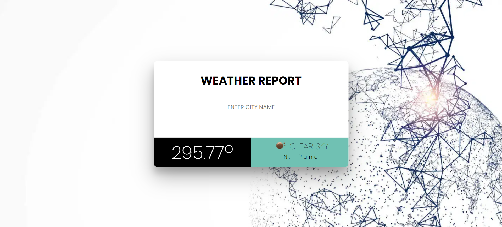

<h1 align="center">
 weatherApp
</h1>

Website: https://weatherreport-app.herokuapp.com/

# Home Page
The Home Page consists of 1 main sections:
weather tile, which includes:
- title: which says Weather Report.
- Search Field: which take input as a city.
- Temperature: It shows the temp of user inputted city.
- Condition and City: It shows the weather condition and City name

# 404 - Page
1) Header, which includes:
- Image: which page not found.
2) Button, which includes:
- Link to Index Page: it redirects you to the main page. 

## Tech-Stack used
- HTML
- CSS
- NodeJS
- **Express** 
- **EJS** 
- **NODE-FETCH** 

## Author
👤 **RaHaT SaYYeD**
- Github: https://github.com/maleficscorpio
- Linkedin: https://www.linkedin.com/in/youreachedrahat
- Email: sayyedrahat721@outlook.com

# Show Your Support

Give a ⭐️ if you like this project!
